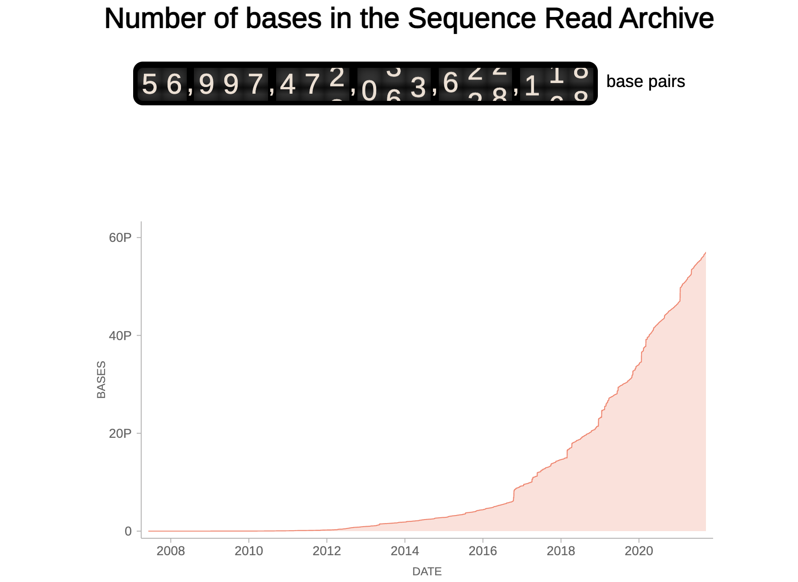

[SRA stats](https://theo.io/srastats/) is a miniproject I built during a train ride from Boston to New York. It simply displays a graph of the number of petabases in the global Sequence Read Archive, along with an odometer style "live" readout, interpolated from these.

