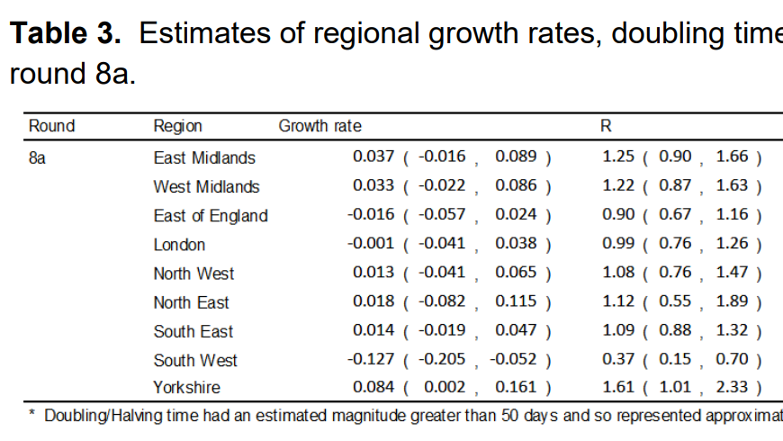

The [latest round of the REACT study](https://spiral.imperial.ac.uk/handle/10044/1/85583) has come out, and been quite controversial. Let's examine some of the raw data behind it.

<pre class='chroma'><code class='language-r' data-lang='r'><a href='https://rdrr.io/r/base/library.html'>library</a>(<a href='http://tidyverse.tidyverse.org'>tidyverse</a>)
</code></pre>

Let's download the REACT data and process it into a nice format:

<pre class='chroma'><code class='language-r' data-lang='r'>positive &lt;- read_csv(<a href='https://rdrr.io/r/base/connections.html'>url</a>("https://raw.githubusercontent.com/mrc-ide/reactidd/master/inst/extdata/positive.csv"))

#&gt; Warning: Missing column names filled in: 'X1' [1]

total &lt;- read_csv(<a href='https://rdrr.io/r/base/connections.html'>url</a>("https://raw.githubusercontent.com/mrc-ide/reactidd/master/inst/extdata/total.csv"))

#&gt; Warning: Missing column names filled in: 'X1' [1]
</code></pre>

<pre class='chroma'><code class='language-r' data-lang='r'>positive$type = "positive"
total$type = "total"
all = bind_rows(positive, total)
<a href='https://rdrr.io/r/base/colnames.html'>colnames</a>(all)[1] = "Date"

all = all %&gt;% pivot_longer(<a href='https://rdrr.io/r/base/c.html'>c</a>(-Date,-type),names_to="Region") %&gt;% pivot_wider(names_from=type)
all

#&gt; # A tibble: 1,485 x 4
#&gt;    Date       Region                   positive total
#&gt;    &lt;date&gt;     &lt;chr&gt;                       &lt;dbl&gt; &lt;dbl&gt;
#&gt;  1 2020-05-05 South East                      0   113
#&gt;  2 2020-05-05 North East                      0    13
#&gt;  3 2020-05-05 North West                      1    73
#&gt;  4 2020-05-05 Yorkshire and The Humber        0    33
#&gt;  5 2020-05-05 East Midlands                   1    77
#&gt;  6 2020-05-05 West Midlands                   0    51
#&gt;  7 2020-05-05 East of England                 0    93
#&gt;  8 2020-05-05 London                          0    39
#&gt;  9 2020-05-05 South West                      0    42
#&gt; 10 2020-05-06 South East                      0    62
#&gt; # … with 1,475 more rowsm
</code></pre>

Now we can calculate binomial confidence intervals by location for each date and plot them.

<pre class='chroma'><code class='language-r' data-lang='r'>all = all %&gt;% <a href='https://rdrr.io/r/stats/filter.html'>filter</a>(!<a href='https://rdrr.io/r/base/NA.html'>is.na</a>(positive)) %&gt;% <a href='https://rdrr.io/r/stats/filter.html'>filter</a>(!<a href='https://rdrr.io/r/base/NA.html'>is.na</a>(total))
<a href='https://rdrr.io/r/base/library.html'>library</a>(binom)

cis = <a href='https://rdrr.io/pkg/binom/man/binom.confint.html'>binom.confint</a>(all$positive,all$total, method="exact")

all$lower=cis$lower
all$mean = cis$mean
all$upper=cis$upper

ggplot(all %&gt;% <a href='https://rdrr.io/r/stats/filter.html'>filter</a>(Date&gt;"2020-12-15"),aes(x=Date,ymin=lower,ymax=upper,y=mean))+geom_pointrange(color="black") +facet_wrap(~Region,scales="free_y")+scale_y_log10(labels = scales::<a href='https://scales.r-lib.org//reference/label_percent.html'>percent</a>)+theme_bw() + labs(y="Probability of testing positive")

#&gt; Warning: Transformation introduced infinite values in continuous y-axis

#&gt; Warning: Transformation introduced infinite values in continuous y-axis

</code></pre>

<pre class='chroma'><code class='language-r' data-lang='r'>

ggsave("plot.png",width=9,height=5, type="cairo")

#&gt; Warning: Transformation introduced infinite values in continuous y-axis

#&gt; Warning: Transformation introduced infinite values in continuous y-axis
</code></pre>

This looks to accord well with the table of R values that REACT provide in Table 3: 

This isn't especially surprising, but I think the visualisation helps to make sense of how these values came to be calculated (even though they are probably based on a more complex analysis weighting for various demographic factors).

That's it for now.

