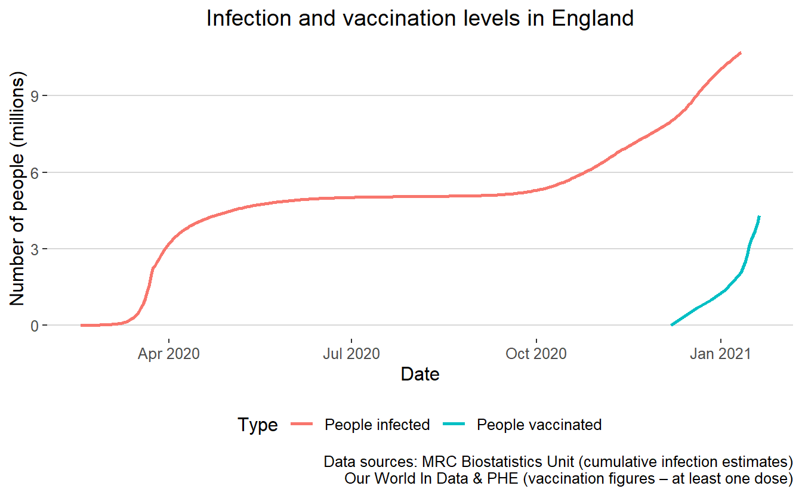
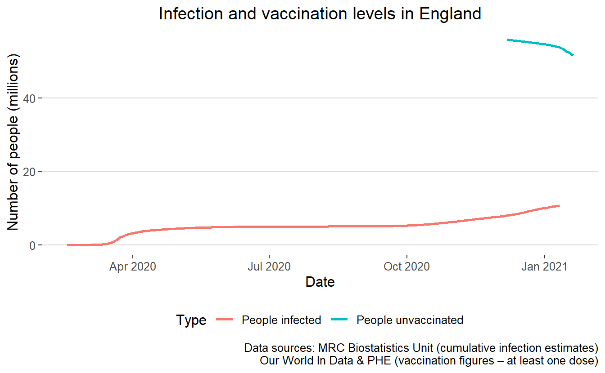

One framing for thinking about COVID is as a race between vaccination and infection, since we expect the former to have at least some mitigating effect on the latter. To get a sense for this I plot the cumulative infection estimates from the [MRC Biostatistics Nowcasting Reports](https://www.mrc-bsu.cam.ac.uk/tackling-covid-19/nowcasting-and-forecasting-of-covid-19/) against the vaccination numbers from [PHE](https://coronavirus.data.gov.uk/details/healthcare) (with historical data filled in from [Our World in Data](https://ourworldindata.org/covid-vaccinations)).

<pre class='chroma'><code class='language-r' data-lang='r'><a href='https://rdrr.io/r/base/try.html'>try</a>(<a href='https://rdrr.io/r/base/library.html'>library</a>(<a href='http://tidyverse.tidyverse.org'>tidyverse</a>), silent=TRUE)
<a href='https://rdrr.io/r/base/library.html'>library</a>(<a href='https://arxiv.org/abs/1403.2805'>jsonlite</a>)
<a href='https://rdrr.io/r/base/library.html'>library</a>(<a href='http://github.com/jrnold/ggthemes'>ggthemes</a>)
a = <a href='https://rdrr.io/pkg/jsonlite/man/fromJSON.html'>fromJSON</a>("mrc_biostats.json")
df=tibble(date=a[[1]],y=a[[2]])
df$date=lubridate::<a href='http://lubridate.tidyverse.org/reference/ymd.html'>ymd</a>(df$date)

df$label = "People infected"
b = read_csv("vaccinations.csv")
b$y=b$numFirstDose
b$date=lubridate::<a href='http://lubridate.tidyverse.org/reference/ymd.html'>dmy</a>(b$date)
b$label = "People vaccinated"
ggplot(bind_rows(df,b),aes(x=date,y=y/1000000,color=label))+geom_line(size=1) +labs(x="Date",y="Number of people (millions)",color="Type",title="Infection and vaccination levels in England",caption="Data sources: MRC Biostatistics Unit (cumulative infection estimates)\nOur World In Data &amp; PHE (vaccination figures – at least one dose)")+<a href='https://rdrr.io/pkg/ggthemes/man/theme_hc.html'>theme_hc</a>()++
  theme(plot.title = element_text(hjust = 0.5))

</code></pre>

<pre class='chroma'><code class='language-r' data-lang='r'>ggsave("plot.png",width=7.3,height=4, type = "cairo") 
</code></pre>

If we literally were to imagine vaccination and infection to be mutually exclusive (which clearly isn't true in either direction), we could plot a graph like this to look at where they might meet.

<pre class='chroma'><code class='language-r' data-lang='r'>

c=b
c$label = "People unvaccinated"
c$y=56000000-c$y
ggplot(bind_rows(df,c),aes(x=date,y=y/1000000,color=label))+geom_line(size=1) +labs(x="Date",y="Number of people (millions)",color="Type",title="Infection and vaccination levels in England",caption="Data sources: MRC Biostatistics Unit (cumulative infection estimates)\nOur World In Data &amp; PHE (vaccination figures – at least one dose)")+<a href='https://rdrr.io/pkg/ggthemes/man/theme_hc.html'>theme_hc</a>()++
  theme(plot.title = element_text(hjust = 0.5))

</code></pre>

<pre class='chroma'><code class='language-r' data-lang='r'>

ggsave("plot2.png",width=7.3,height=4, type = "cairo") 
</code></pre>

