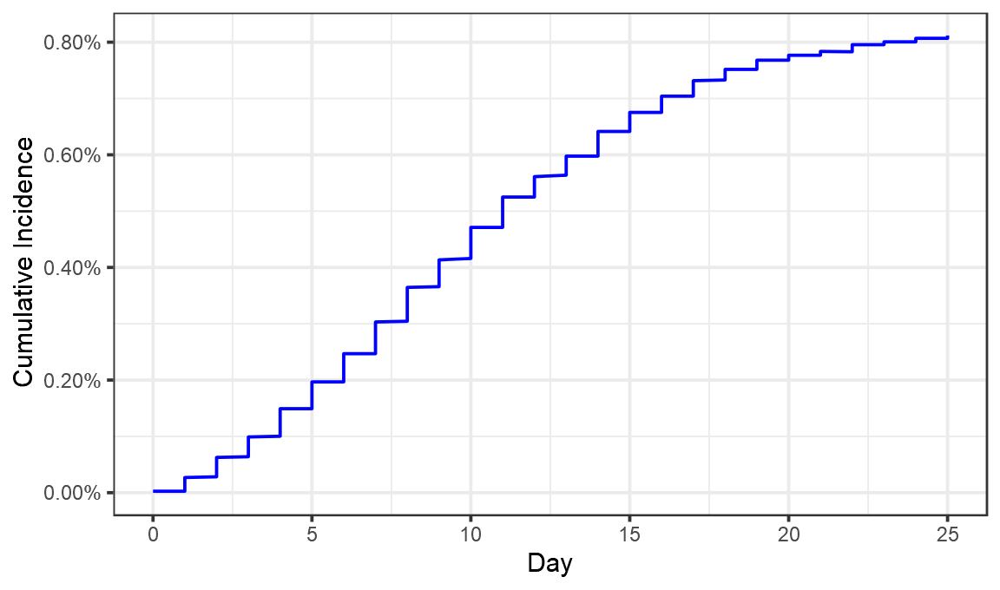
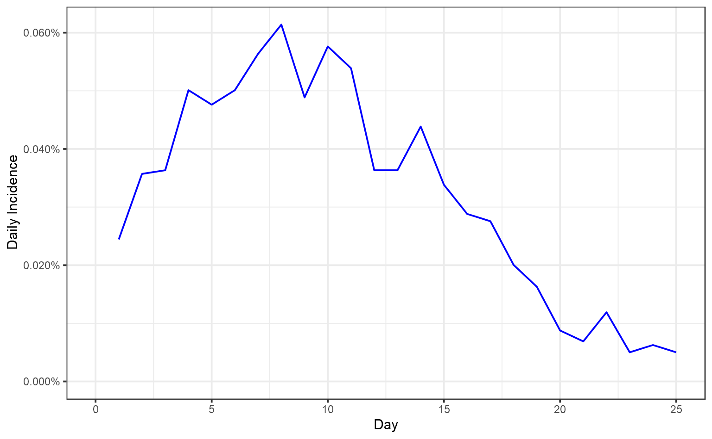
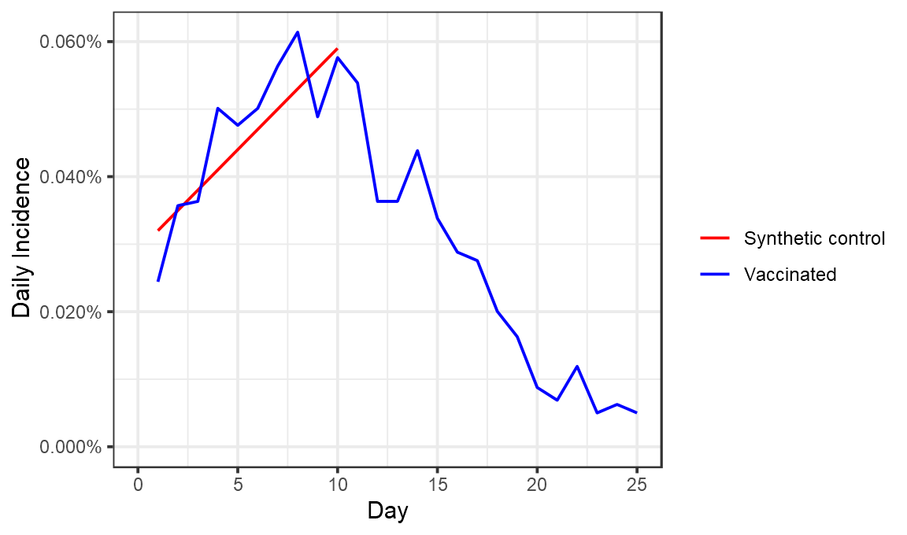
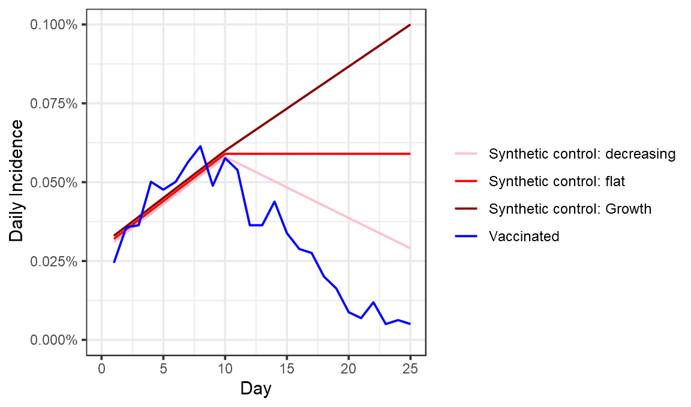
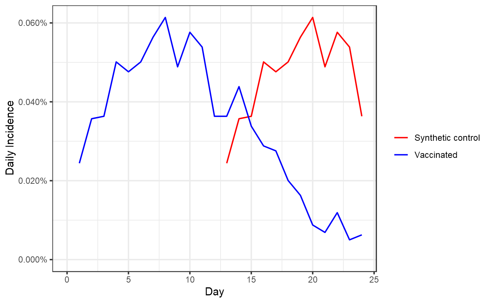
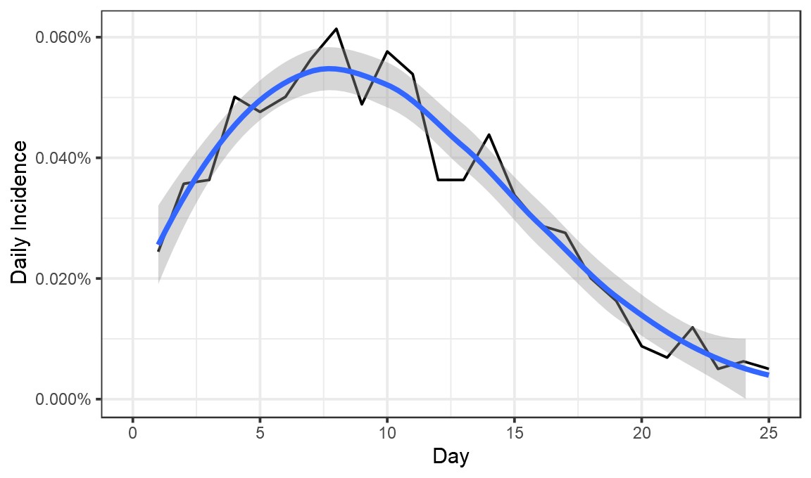
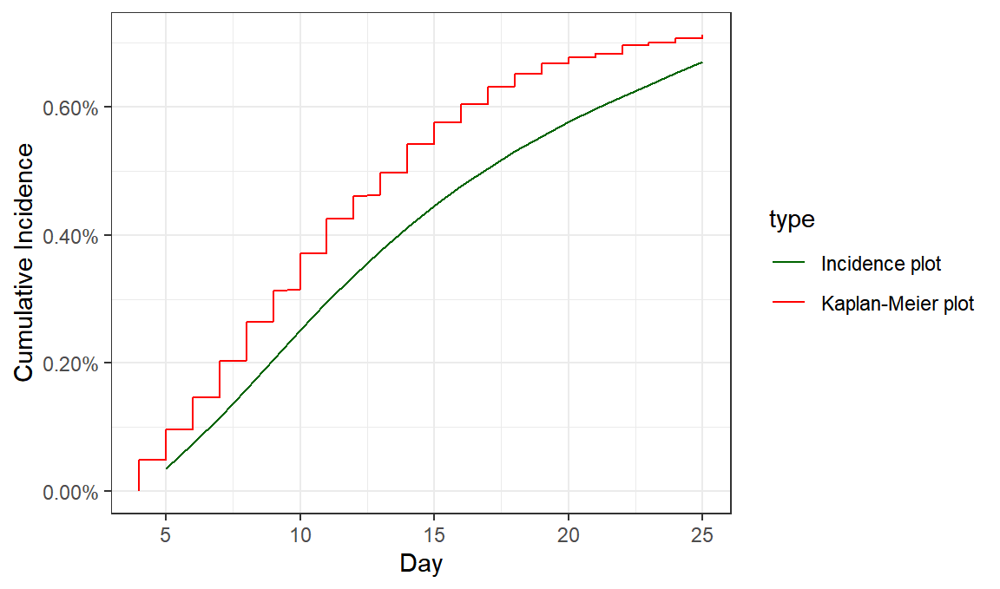

**Update(2021-02-03):** Maccabi have also now released a [different report](https://kinstitute.org.il/wp-content/uploads/2021/02/linkedin-post-28-days-01.02-3-PDF.pdf) looking at a cohort, which gives a less rosy picture of initial efficacy. The explanation may be the older age group in the cohort. I think the calculations below still stand, but am flagging this important further data for context.

Maccabi have now released a [preprint](https://www.medrxiv.org/content/10.1101/2021.01.27.21250612v1) on Pfizer vaccine efficacy after the first dose. Let's take a look at it.

Firstly a little complaint. If you go to the \`Data' tab on bioRxiv, it says:

Now of course one understands that there may be lots of underlying patient data that can't be released for regulatory reasons. But some data definitely can, because they release it in this preprint, in graphical form.

At bare minimum, we should demand that the data directly plotted in graphs are released in numerical form to permit further analysis. There can be no regulatory justification for not doing so.

Fortunately, the data are there, we just need to extract them. For this image file I did that by hand with [WebPlotDigitizer](https://apps.automeris.io/wpd/).

<pre class='chroma'><code class='language-r' data-lang='r'>maccabi = read_csv("maccabi.csv",col_names = <a href='https://rdrr.io/r/base/c.html'>c</a>('Day','CumulativeIncidence')) %&gt;% mutate(Day=<a href='https://rdrr.io/r/base/Round.html'>round</a>(Day)) 

ggplot(maccabi,aes(x=Day,y=CumulativeIncidence))+geom_line(color="blue")+theme_bw()+labs(x="Day",y="Cumulative Incidence")+scale_y_continuous(labels=scales::<a href='https://scales.r-lib.org//reference/label_percent.html'>percent</a>,limits=<a href='https://rdrr.io/r/base/c.html'>c</a>(0,NA))

</code></pre>

Looks like we've pretty much got it. Now let's convert that cumulative incidence into a daily incidence (something not done in the Maccabi preprint).

<pre class='chroma'><code class='language-r' data-lang='r'>perday = maccabi %&gt;% arrange(Day,CumulativeIncidence) %&gt;% group_by(Day) %&gt;% summarise(CumulativeIncidence=<a href='https://rdrr.io/r/base/Extremes.html'>max</a>(CumulativeIncidence)) %&gt;% mutate(DailyIncidence=CumulativeIncidence-<a href='https://rdrr.io/r/stats/lag.html'>lag</a>(CumulativeIncidence),type="Vaccinated") 

ggplot(perday,aes(x=Day,y=DailyIncidence))+geom_line(color="blue")+theme_bw()+labs(x="Day",y="Daily Incidence")+scale_y_continuous(labels=scales::<a href='https://scales.r-lib.org//reference/label_percent.html'>percent</a>,limits=<a href='https://rdrr.io/r/base/c.html'>c</a>(0,NA)) 

</code></pre>

Now we have a fair idea of what went on. On day 1 after vaccination, 0.024% of those vaccinated tested positive. That proportion seems to have risen until about day 8, when 0.06% of those vaccinated tested positive. It then fell until day 25, when just 0.005% tested positive.

Now, to properly calculate vaccine efficacy we would need some control group who have not been vaccinated. In the original trials that was a randomly selected half who were given a placebo injection. We compared how many cases they developed, as compared to those who were vaccinated.

There is no placebo group here. No set of matching people who were not vaccinated. So to have any way of calculating an efficacy value we essentially have to invent one and imagine what the incidence would have been in it.

Doing this for the first \~10 days, seems pretty easy. We really don't expect to see the vaccine have any effect here, so the control group might look something like this:

<pre class='chroma'><code class='language-r' data-lang='r'>control_group = tibble(Day=1:10,DailyIncidence=<a href='https://rdrr.io/r/base/seq.html'>seq</a>(0.00032,0.00059,length.out=10),type="Synthetic control")
ggplot(bind_rows(control_group, perday),aes(x=Day,y=DailyIncidence,color=type))+geom_line()+theme_bw()+labs(color="",x="Day",y="Daily Incidence")+scale_y_continuous(labels=scales::<a href='https://scales.r-lib.org//reference/label_percent.html'>percent</a>,limits=<a href='https://rdrr.io/r/base/c.html'>c</a>(0,NA)) +scale_color_manual(values=<a href='https://rdrr.io/r/base/c.html'>c</a>("red","blue"))

</code></pre>

The reason for this not being a horizontal line would have to be some genuine rise in cases over this period. One possibility is the general increasing number of cases in Israel, which continued up to around 15 Jan. 

Unforunately, having this synthetic control line for the first 7 days isn't especially useful. By construction this shows \~0% efficacy in that period, because that's what we designed it to. What I'm really interested is that the efficacy around Day 24. So how should we extend the line?

I've illustrated 3 possible scenarios below, one where cases continue to rise in the placebo group, another where they stay flat, and another where they fall :

<pre class='chroma'><code class='language-r' data-lang='r'> syn_control &lt;- function(final, name,offset)&#123;
<a href='https://rdrr.io/r/base/function.html'>return</a>(bind_rows(tibble(Day=1:10,DailyIncidence=<a href='https://rdrr.io/r/base/seq.html'>seq</a>(0.00032+offset,0.00059+offset,length.out=10),type=name),
                  tibble(Day=10:25,DailyIncidence=<a href='https://rdrr.io/r/base/seq.html'>seq</a>(0.00059+offset,final,length.out=16),type=name)) )
&#125;
combo =bind_rows(syn_control(0.0010,"Synthetic control: Growth",0.00001),syn_control(0.00059,"Synthetic control: flat",0),syn_control(0.00029,"Synthetic control: decreasing",-0.00001), perday)
ggplot(combo,aes(x=Day,y=DailyIncidence,color=type))+geom_line()+theme_bw()+labs(color="",x="Day",y="Daily Incidence")+scale_y_continuous(labels=scales::<a href='https://scales.r-lib.org//reference/label_percent.html'>percent</a>,limits=<a href='https://rdrr.io/r/base/c.html'>c</a>(0,NA)) +scale_color_manual(values=<a href='https://rdrr.io/r/base/c.html'>c</a>("pink","red","darkred","blue"))

</code></pre>

These choices have a substantial effect on the efficacy we measure for days 23-25, which range from 82% (placebo cases fall) to 94% (placebo cases rise).

<pre class='chroma'><code class='language-r' data-lang='r'>combo %&gt;% <a href='https://rdrr.io/r/stats/filter.html'>filter</a>(Day&gt;22) %&gt;% group_by(type) %&gt;% summarise(Incidence = <a href='https://rdrr.io/r/base/mean.html'>mean</a>(DailyIncidence)) %&gt;% mutate(efficacy_percent = 100*(1- <a href='https://rdrr.io/r/base/Extremes.html'>min</a>(Incidence)/Incidence)) %&gt;% <a href='https://rdrr.io/r/stats/filter.html'>filter</a>(type!="Vaccinated") %&gt;% select(-Incidence)

#&gt; `summarise()` ungrouping output (override with `.groups` argument)

#&gt; # A tibble: 3 x 2
#&gt;   type                          efficacy_percent
#&gt;   &lt;chr&gt;                                    &lt;dbl&gt;
#&gt; 1 Synthetic control: decreasing             82.4
#&gt; 2 Synthetic control: flat                   90.8
#&gt; 3 Synthetic control: Growth                 94.4
</code></pre>

So what did Maccabi do? Well something quite different to any of these. They used the period from days 0 to 12 as the control for days 13 to 24. That looks like this:

<pre class='chroma'><code class='language-r' data-lang='r'>control_group = perday %&gt;% mutate(Day=Day+12, type= "Synthetic control") %&gt;% <a href='https://rdrr.io/r/stats/filter.html'>filter</a>(Day&lt;25)
maccabi_analysis = bind_rows(control_group, perday %&gt;% <a href='https://rdrr.io/r/stats/filter.html'>filter</a>(Day&lt;25))
ggplot(maccabi_analysis,aes(x=Day,y=DailyIncidence,color=type))+geom_line()+theme_bw()+labs(color="",x="Day",y="Daily Incidence")+scale_y_continuous(labels=scales::<a href='https://scales.r-lib.org//reference/label_percent.html'>percent</a>,limits=<a href='https://rdrr.io/r/base/c.html'>c</a>(0,NA)) +scale_color_manual(values=<a href='https://rdrr.io/r/base/c.html'>c</a>("red","blue"))

</code></pre>

If again you look at day 23-24 efficacy here, you get an efficacy of 88%.

<pre class='chroma'><code class='language-r' data-lang='r'>maccabi_analysis %&gt;% <a href='https://rdrr.io/r/stats/filter.html'>filter</a>(Day&gt;22) %&gt;% group_by(type) %&gt;% summarise(Incidence = <a href='https://rdrr.io/r/base/mean.html'>mean</a>(DailyIncidence)) %&gt;% mutate(efficacy_percent = 100*(1- <a href='https://rdrr.io/r/base/Extremes.html'>min</a>(Incidence)/Incidence)) %&gt;% <a href='https://rdrr.io/r/stats/filter.html'>filter</a>(type!="Vaccinated") %&gt;% select(-Incidence)

#&gt; `summarise()` ungrouping output (override with `.groups` argument)

#&gt; # A tibble: 1 x 2
#&gt;   type              efficacy_percent
#&gt;   &lt;chr&gt;                        &lt;dbl&gt;
#&gt; 1 Synthetic control             87.5
</code></pre>

Maccabi however looked across the entire period. If you do that you get an efficacy close to 50% (they got 51%, I got 56%, possibly due to slight differences in the weighting of different days based on the number of people in them).

<pre class='chroma'><code class='language-r' data-lang='r'>maccabi_analysis %&gt;% <a href='https://rdrr.io/r/stats/filter.html'>filter</a>(Day&gt;12) %&gt;% group_by(type) %&gt;% summarise(Incidence = <a href='https://rdrr.io/r/base/mean.html'>mean</a>(DailyIncidence)) %&gt;% mutate(efficacy_percent = 100*(1- <a href='https://rdrr.io/r/base/Extremes.html'>min</a>(Incidence)/Incidence)) %&gt;% <a href='https://rdrr.io/r/stats/filter.html'>filter</a>(type!="Vaccinated") %&gt;% select(-Incidence)

#&gt; `summarise()` ungrouping output (override with `.groups` argument)

#&gt; # A tibble: 1 x 2
#&gt;   type              efficacy_percent
#&gt;   &lt;chr&gt;                        &lt;dbl&gt;
#&gt; 1 Synthetic control             56.1
</code></pre>

So, what to conclude? Essentially the way Maccabi analysed this data was one relatively arbitrary possibility among many. Efficacy estimates are quite sensitive to the guesses one makes about how many cases there would have been in the control group. Maccabi's decision here is quite conservative in that it includes as a control group the day 10 to 12 period where some cases may well have been averted by vaccination.

The decision to look at the entire day 12-24 period rather than the end of it, will yield a result lower than the true efficacy towards the end of this period, given the clear evidence for an increase in efficacy over the period. This is incredibly valuable data, and all in all, things look pretty good.

<pre class='chroma'><code class='language-r' data-lang='r'>ggplot(perday,aes(x=Day,y=DailyIncidence))+geom_line(color="black")+theme_bw()+labs(x="Day",y="Daily Incidence")+scale_y_continuous(labels=scales::<a href='https://scales.r-lib.org//reference/label_percent.html'>percent</a>,limits=<a href='https://rdrr.io/r/base/c.html'>c</a>(0,NA)) +geom_smooth()

#&gt; `geom_smooth()` using method = 'loess' and formula 'y ~ x'

</code></pre>

<pre class='chroma'><code class='language-r' data-lang='r'>perday

#&gt; # A tibble: 26 x 4
#&gt;      Day CumulativeIncidence DailyIncidence type      
#&gt;    &lt;dbl&gt;               &lt;dbl&gt;          &lt;dbl&gt; &lt;chr&gt;     
#&gt;  1     0           0.0000251      NA        Vaccinated
#&gt;  2     1           0.000269        0.000244 Vaccinated
#&gt;  3     2           0.000626        0.000357 Vaccinated
#&gt;  4     3           0.000990        0.000363 Vaccinated
#&gt;  5     4           0.00149         0.000501 Vaccinated
#&gt;  6     5           0.00197         0.000476 Vaccinated
#&gt;  7     6           0.00247         0.000501 Vaccinated
#&gt;  8     7           0.00303         0.000564 Vaccinated
#&gt;  9     8           0.00365         0.000614 Vaccinated
#&gt; 10     9           0.00413         0.000489 Vaccinated
#&gt; # … with 16 more rowsm

incidence_data = read_csv("data_from_chart.csv") 

#&gt; Parsed with column specification:
#&gt; cols(
#&gt;   Day = col_double(),
#&gt;   VaccinatedCohort = col_double()
#&gt; )

cohort_size=132015
incidence_data$CumulativeIncidence = <a href='https://rdrr.io/r/base/cumsum.html'>cumsum</a>(incidence_data$VaccinatedCohort)/ cohort_size
incidence_data$type = "Incidence plot"

maccabi_offset = maccabi %&gt;% <a href='https://rdrr.io/r/stats/filter.html'>filter</a>(Day&gt;3) %&gt;% mutate(CumulativeIncidence = CumulativeIncidence-<a href='https://rdrr.io/r/base/Extremes.html'>min</a>(CumulativeIncidence), type="Kaplan-Meier plot" )
 

ggplot(bind_rows(incidence_data,maccabi_offset),aes(color=type, group=type, x=Day,y=CumulativeIncidence))+geom_line()+theme_bw()+labs(x="Day",y="Cumulative Incidence")+scale_y_continuous(labels=scales::<a href='https://scales.r-lib.org//reference/label_percent.html'>percent</a>,limits=<a href='https://rdrr.io/r/base/c.html'>c</a>(0,NA)) +scale_color_manual(values=<a href='https://rdrr.io/r/base/c.html'>c</a>("darkgreen","red"))

</code></pre>

<pre class='chroma'><code class='language-r' data-lang='r'>
ggsave("comparison.png",type="cairo",width=7,height=3)
</code></pre>

