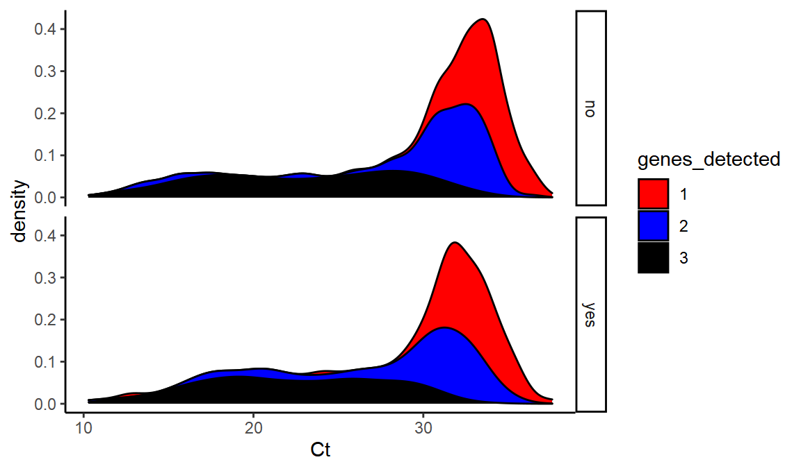
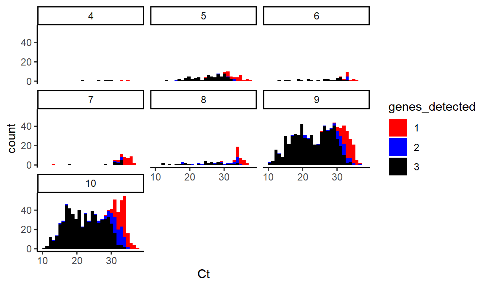

**Summary:** The ONS Coronavirus Infection Survey is an immensely valuable scientific project measuring prevalence of coronavirus in the community. However some useful data have only been released in graphical form which makes them hard to re-analyse. I extracted a line-list like dataset containing: swab date, overall Ct value, symptomatic status, and number of genes detected (1, 2 or 3) from a [preprint](https://www.medrxiv.org/content/10.1101/2020.10.25.20219048v1) describing testing work from 26 April--11 October 2020. Here I [make this data available](/ons_ct_values_and_symptoms.csv) for further analysis, and describe the extraction process.

### Background

The ONS infection survey is an extremely valuable and well-conducted piece of work.

As I discussed in [a previous post](/post/2021-01-22-ons-data/) sometimes the raw data outputs can be subject to different interpretations.

<pre class='chroma'><code class='language-r' data-lang='r'>knitr::<a href='https://rdrr.io/pkg/knitr/man/opts_chunk.html'>opts_chunk</a>$set(dev.args = <a href='https://rdrr.io/r/base/list.html'>list</a>(png = <a href='https://rdrr.io/r/base/list.html'>list</a>(type = "cairo")))
<a href='https://rdrr.io/r/base/library.html'>require</a>(<a href='https://xml2.r-lib.org/'>xml2</a>)
<a href='https://rdrr.io/r/base/library.html'>library</a>(<a href='http://tidyverse.tidyverse.org'>tidyverse</a>)
<a href='https://rdrr.io/r/base/library.html'>library</a>(<a href='http://lubridate.tidyverse.org'>lubridate</a>)
<a href='https://rdrr.io/r/base/library.html'>library</a>(<a href='http://rvest.tidyverse.org/'>rvest</a>)

</code></pre>

First we will read in the SVG file as XML and look at the straight lines - i.e. the axis plots and so on.

<pre class='chroma'><code class='language-r' data-lang='r'>theme_set(theme_classic())

doc &lt;- <a href='http://xml2.r-lib.org/reference/read_xml.html'>read_xml</a>("ons_scatterplot.svg") %&gt;% <a href='http://xml2.r-lib.org/reference/xml_ns_strip.html'>xml_ns_strip</a>()
lines &lt;- <a href='https://rvest.tidyverse.org/reference/xml.html'>xml_nodes</a>(doc, "line")

linesdf &lt;-
  tibble(bind_rows(<a href='https://rdrr.io/r/base/lapply.html'>lapply</a>(<a href='http://xml2.r-lib.org/reference/xml_attr.html'>xml_attrs</a>(lines), as.data.frame.list))) %&gt;%
  mutate_at(<a href='https://rdrr.io/r/base/c.html'>c</a>("x1", "x2", "y1", "y2"), as.character) %&gt;%
  mutate_at(<a href='https://rdrr.io/r/base/c.html'>c</a>("x1", "x2", "y1", "y2"), as.numeric) %&gt;%
  mutate(y1 = -y1, y2 = -y2) %&gt;%
  mutate(length = <a href='https://rdrr.io/r/base/MathFun.html'>sqrt</a>((x2 - x1)^2 + (y2 - y1)^2))
</code></pre>

Let's try drawing this set of lines.

<pre class='chroma'><code class='language-r' data-lang='r'>ggplot(linesdf, aes(x = x1, xend = x2, y = y1, yend = y2, color = class)) +
  geom_segment()

</code></pre>

OK, so `st14` represents the black lines of the axis - lets extract those some more and mark them as horizontal or vertical.

<pre class='chroma'><code class='language-r' data-lang='r'>
black_lines &lt;- linesdf %&gt;%
  <a href='https://rdrr.io/r/stats/filter.html'>filter</a>(class == "st14") %&gt;%
  mutate(horizontal = <a href='https://rdrr.io/r/base/MathFun.html'>abs</a>(y2 - y1) &lt; 10 * <a href='https://rdrr.io/r/base/MathFun.html'>abs</a>(x2 - x1)) %&gt;%
  mutate(vertical = !horizontal)

ggplot(black_lines, aes(x = x1, xend = x2, y = y1, yend = y2, color = horizontal)) +
  geom_segment()

</code></pre>

We can also look at the distribution of line lengths to be able to separate out the short 'ticks'.

<pre class='chroma'><code class='language-r' data-lang='r'>ggplot(black_lines, aes(x = length)) +
  geom_histogram()

#&gt; `stat_bin()` using `bins = 30`. Pick better value with `binwidth`.

</code></pre>

It looks like any line with length less than 30 will be a tick.

<pre class='chroma'><code class='language-r' data-lang='r'>
ticks &lt;- black_lines %&gt;%
  mutate(is_tick = length &lt; 30) %&gt;%
  <a href='https://rdrr.io/r/stats/filter.html'>filter</a>(is_tick)
horiz_limits &lt;- ticks %&gt;%
  <a href='https://rdrr.io/r/stats/filter.html'>filter</a>(horizontal) %&gt;%
  <a href='https://rdrr.io/r/stats/filter.html'>filter</a>(y1 == <a href='https://rdrr.io/r/base/Extremes.html'>max</a>(y1) | y1 == <a href='https://rdrr.io/r/base/Extremes.html'>min</a>(y1))
vert_limits &lt;- ticks %&gt;%
  <a href='https://rdrr.io/r/stats/filter.html'>filter</a>(vertical) %&gt;%
  <a href='https://rdrr.io/r/stats/filter.html'>filter</a>(x1 == <a href='https://rdrr.io/r/base/Extremes.html'>max</a>(x1) | x1 == <a href='https://rdrr.io/r/base/Extremes.html'>min</a>(x1))

#ggplot(bind_rows(horiz_limits, vert_limits), aes(x = x1, xend = x2, y = y1, yend = y2, color = horizontal)) +
#  geom_segment()
</code></pre>

Now we can extract the positions of the maximum and minimum tick for each axis, and manually write in the real values those correspond to from the label:

<pre class='chroma'><code class='language-r' data-lang='r'>x_min_svg &lt;- <a href='https://rdrr.io/r/base/Extremes.html'>min</a>(vert_limits$x1)
x_max_svg &lt;- <a href='https://rdrr.io/r/base/Extremes.html'>max</a>(vert_limits$x1)
y_min_svg &lt;- <a href='https://rdrr.io/r/base/Extremes.html'>min</a>(horiz_limits$y1)
y_max_svg &lt;- <a href='https://rdrr.io/r/base/Extremes.html'>max</a>(horiz_limits$y1)

x_min_real &lt;- <a href='http://lubridate.tidyverse.org/reference/ymd.html'>ymd</a>("2020-04-26")
x_max_real &lt;- <a href='http://lubridate.tidyverse.org/reference/ymd.html'>ymd</a>("2020-10-11")
y_min_real &lt;- 10
y_max_real &lt;- 40
</code></pre>

We've dealt with the axes. Now time to move onto the points. Unfortunately they are not points, they are paths (bezier-curves), drawing circles to represent points!

Here is a [useful tool for interpreting SVG commands](https://svg-path-visualizer.netlify.app/)

We'll extract all the paths  

<pre class='chroma'><code class='language-r' data-lang='r'>paths &lt;- <a href='https://rvest.tidyverse.org/reference/xml.html'>xml_nodes</a>(doc, "path")
</code></pre>

And then try to split up the bezier curves into sub commands, like `M` (move to a point), `C` draw a curve in absolute coordinates, `c` draw a curve in relative coordinates, and so on.

<pre class='chroma'><code class='language-r' data-lang='r'>pathsdf &lt;-
  tibble(bind_rows(<a href='https://rdrr.io/r/base/lapply.html'>lapply</a>(<a href='http://xml2.r-lib.org/reference/xml_attr.html'>xml_attrs</a>(paths), as.data.frame.list))) %&gt;%
  mutate(id = 1:n()) %&gt;%
  mutate(d = <a href='https://rdrr.io/r/base/grep.html'>gsub</a>("S", "|S", d)) %&gt;%
  mutate(d = <a href='https://rdrr.io/r/base/grep.html'>gsub</a>("s", "|s", d)) %&gt;%
  mutate(d = <a href='https://rdrr.io/r/base/grep.html'>gsub</a>("z", "|z", d)) %&gt;%
  mutate(d = <a href='https://rdrr.io/r/base/grep.html'>gsub</a>("c", "|c:", d)) %&gt;%
  mutate(d = <a href='https://rdrr.io/r/base/grep.html'>gsub</a>("C", "|C:", d)) %&gt;%
  mutate(d = <a href='https://rdrr.io/r/base/grep.html'>gsub</a>("M", "M:", d)) %&gt;%
  mutate(d = <a href='https://rdrr.io/r/base/grep.html'>gsub</a>("\n", "", d)) %&gt;%
  mutate(d = <a href='https://rdrr.io/r/base/grep.html'>gsub</a>(" ", "", d)) %&gt;%
  mutate(d = <a href='https://rdrr.io/r/base/grep.html'>gsub</a>("([0-9])-", "\\1,-", d))

commandsdf &lt;- pathsdf %&gt;%
  separate_rows(d, sep = "\\|") %&gt;%
  <a href='https://rdrr.io/r/stats/filter.html'>filter</a>(d != "z") %&gt;%
  separate(d, into = <a href='https://rdrr.io/r/base/c.html'>c</a>("command", "parameters"), ":")

#&gt; Warning: Expected 2 pieces. Missing pieces filled with `NA` in 24 rows [23, 25, 28, 30, 7933, 7935, 7938, 7940, 8673, 8675, 8678, 8680, 16233, 16235, 16238, 16240, 16243, 16245, 16248, 16250, ...].

commandsdf %&gt;%
  group_by(id, command) %&gt;%
  summarise(n = n()) %&gt;%
  group_by(n, command) %&gt;%
  summarise(count = n())

#&gt; `summarise()` regrouping output by 'id' (override with `.groups` argument)

#&gt; `summarise()` regrouping output by 'n' (override with `.groups` argument)

#&gt; # A tibble: 15 x 3
#&gt; # Groups:   n [3]
#&gt;        n command                  count
#&gt;    &lt;int&gt; &lt;chr&gt;                    &lt;int&gt;
#&gt;  1     1 C                         3784
#&gt;  2     1 M                         3796
#&gt;  3     1 s-0.72,0.36,-0.72,0.72       2
#&gt;  4     1 s-0.72,0.36,-0.72,0.9        4
#&gt;  5     1 S43,38.37,43,38.91           2
#&gt;  6     1 S43,54.21,43,54.75           2
#&gt;  7     1 S43,75.45,43,75.99           2
#&gt;  8     1 S44.44,39.27,44.44,38.91     2
#&gt;  9     1 S44.44,55.29,44.44,54.75     2
#&gt; 10     1 S44.44,76.53,44.44,75.99     2
#&gt; 11     1 S55.78,40.89,55.78,40.53     2
#&gt; 12     1 S55.78,44.49,55.78,44.13     2
#&gt; 13     1 S55.78,62.49,55.78,62.13     2
#&gt; 14     2 c                           12
#&gt; 15     3 c                         3784

commands_processed &lt;- commandsdf %&gt;%
  separate(parameters, into = <a href='https://rdrr.io/r/base/c.html'>c</a>("p1", "p2", "p3", "p4", "p5", "p6"), sep = ",") %&gt;%
  mutate(abs_x = case_when(command == "M" ~ p1, command == "C" ~ p5), abs_y = case_when(command == "M" ~ p2, command == "C" ~ p6)) %&gt;%
  mutate(rel_x = case_when(command == "c" ~ p5), rel_y = case_when(command == "c" ~ p6))

#&gt; Warning: Expected 6 pieces. Missing pieces filled with `NA` in 3796 rows [1, 6, 11, 16, 21, 26, 31, 36, 41, 46, 51, 56, 61, 66, 71, 76, 81, 86, 91, 96, ...].
</code></pre>

These circles are represented as 4 curves, with 4 control points. If we take the average of these we can find the position of the point. One of the points in just the `M` coordinates, but 3 are from `c` commands, and they only have relative coordinates, so we need to calculate the cumulative sums of these, and then add them to the `M` coordinates. Then we average out, and add back the class metadata.

<pre class='chroma'><code class='language-r' data-lang='r'>lowercase_cs &lt;- commands_processed %&gt;%
  group_by(id) %&gt;%
  <a href='https://rdrr.io/r/stats/filter.html'>filter</a>(command == "c") %&gt;%
  mutate(rel_x_sum = <a href='https://rdrr.io/r/base/cumsum.html'>cumsum</a>(rel_x), rel_y_sum = <a href='https://rdrr.io/r/base/cumsum.html'>cumsum</a>(rel_y)) %&gt;%
  select(id, rel_x_sum, rel_y_sum)

zeroes &lt;- lowercase_cs %&gt;%
  group_by(id) %&gt;%
  summarise(rel_x_sum = 0, rel_y_sum = 0)

#&gt; `summarise()` ungrouping output (override with `.groups` argument)

full_relative_set &lt;- bind_rows(lowercase_cs, zeroes)

uppercase_cs &lt;- commands_processed %&gt;%
  <a href='https://rdrr.io/r/stats/filter.html'>filter</a>(command == "C") %&gt;%
  select(id, command, abs_x, abs_y) %&gt;%
  mutate(abs_x = <a href='https://rdrr.io/r/base/numeric.html'>as.numeric</a>(abs_x), abs_y = <a href='https://rdrr.io/r/base/numeric.html'>as.numeric</a>(abs_y))

both &lt;- inner_join(uppercase_cs, full_relative_set, by = "id") %&gt;% mutate(x = abs_x + rel_x_sum, y = abs_y + rel_y_sum)

point_types &lt;- pathsdf %&gt;% select(id, class)

points &lt;- both %&gt;%
  group_by(id) %&gt;%
  summarise(x = <a href='https://rdrr.io/r/base/mean.html'>mean</a>(x), y = <a href='https://rdrr.io/r/base/mean.html'>mean</a>(y)) %&gt;%
  inner_join(point_types, by = "id") %&gt;%
  mutate(y = -y) %&gt;%
  <a href='https://rdrr.io/r/stats/filter.html'>filter</a>(class %in% <a href='https://rdrr.io/r/base/c.html'>c</a>("st10", "st7", "st9", "st12", "st11", "st5"))

#&gt; `summarise()` ungrouping output (override with `.groups` argument)
</code></pre>

Above you can see I have filtered to only some of the classes. This is because some points were represented by two curves, one a stroke and one a fill. Now let's plot the points.

<pre class='chroma'><code class='language-r' data-lang='r'>ggplot(black_lines, aes(x = x1, xend = x2, y = y1, yend = y2)) +
  geom_segment() +
  geom_point(data = points %&gt;% mutate(x2 = 0, y2 = 0), aes(x = x, y = y, color = class)) +
  scale_color_brewer(type = "qual", palette = "Paired")

</code></pre>

Conveniently, the points in the key are still there, so we can easily label these classes with their correct metadata

<pre class='chroma'><code class='language-r' data-lang='r'>genes_detected &lt;- <a href='https://rdrr.io/r/base/c.html'>c</a>(1, 1, 2, 2, 3, 3)
symptoms &lt;- <a href='https://rdrr.io/r/base/c.html'>c</a>("yes", "no", "yes", "no", "yes", "no")
classes &lt;- <a href='https://rdrr.io/r/base/c.html'>c</a>("st9", "st12", "st7", "st11", "st5", "st10")

class_info &lt;- tibble(class = classes, symptoms = symptoms, genes_detected = genes_detected)

points_detail &lt;- points %&gt;%
  inner_join(class_info) %&gt;%
  mutate(genes_detected = <a href='https://rdrr.io/r/base/factor.html'>as.factor</a>(genes_detected))

#&gt; Joining, by = "class"

ggplot(black_lines, aes(x = x1, xend = x2, y = y1, yend = y2)) +
  geom_segment() +
  geom_point(data = points_detail %&gt;% mutate(x2 = 0, y2 = 0), aes(x = x, y = y, color = genes_detected, shape = symptoms)) +
  scale_color_manual(values = <a href='https://rdrr.io/r/base/c.html'>c</a>("red", "blue", "black"))+scale_shape_manual(values=<a href='https://rdrr.io/r/base/c.html'>c</a>(1,16))

</code></pre>

Getting there!

Now we just need to transform ourselves into the right axes:

<pre class='chroma'><code class='language-r' data-lang='r'>
transform &lt;- function(vector, a_in, a_out, b_in, b_out) &#123;
  scaling &lt;- (b_out - a_out) / (b_in - a_in)
  vector &lt;- (vector - a_in) * scaling + a_out
  <a href='https://rdrr.io/r/base/function.html'>return</a>(vector)
&#125;

ytransform &lt;- partial(transform, a_in = y_min_svg, a_out = y_min_real, b_in = y_max_svg, b_out = y_max_real)
xtransform &lt;- partial(transform, a_in = x_min_svg, a_out = x_min_real, b_in = x_max_svg, b_out = x_max_real)

new_axes &lt;- black_lines %&gt;% mutate(y1 = ytransform(y1), y2 = ytransform(y2), x1 = xtransform(x1), x2 = xtransform(x2))

points_transformed &lt;- points_detail %&gt;% mutate(y = ytransform(y), x = xtransform(x))

ggplot(new_axes, ) +
  geom_segment(aes(x = x1, xend = x2, y = y1, yend = y2)) +
  geom_point(data = points_transformed %&gt;% mutate(x2 = <a href='http://lubridate.tidyverse.org/reference/ymd.html'>ymd</a>("2020-01-01"), y2 = <a href='http://lubridate.tidyverse.org/reference/ymd.html'>ymd</a>("2020-01-01")), aes(x = x, y = y, color = genes_detected, shape = symptoms)) +
  scale_color_manual(values = <a href='https://rdrr.io/r/base/c.html'>c</a>("red", "blue", "black"))+scale_shape_manual(values=<a href='https://rdrr.io/r/base/c.html'>c</a>(1,16))

</code></pre>

OK, at this point we can throw away the axes and just focus on the points.

<pre class='chroma'><code class='language-r' data-lang='r'>values &lt;- points_transformed %&gt;%
  <a href='https://rdrr.io/r/stats/filter.html'>filter</a>(y &gt; 0) %&gt;%
  mutate(Date = x, Ct = y) %&gt;%
  select(-x, -y, -class,-id)

write_csv(values, "extracted_ct_value_genes_detected_and_symptoms.csv")
values

#&gt; # A tibble: 1,886 x 4
#&gt;    symptoms genes_detected Date          Ct
#&gt;    &lt;chr&gt;    &lt;fct&gt;          &lt;date&gt;     &lt;dbl&gt;
#&gt;  1 yes      3              2020-04-28  26.8
#&gt;  2 yes      3              2020-04-28  21.7
#&gt;  3 yes      3              2020-05-07  22.9
#&gt;  4 yes      3              2020-05-09  29.4
#&gt;  5 yes      3              2020-05-10  21.8
#&gt;  6 yes      3              2020-05-10  27.3
#&gt;  7 yes      3              2020-05-11  18.1
#&gt;  8 yes      3              2020-05-11  16.8
#&gt;  9 yes      3              2020-05-11  27.3
#&gt; 10 yes      3              2020-05-13  19.3
#&gt; # … with 1,876 more rowsm
</code></pre>

And there's our dataset.

And here's our graph

<pre class='chroma'><code class='language-r' data-lang='r'>ggplot(values,aes(x=Date,y=Ct,color=genes_detected,shape=symptoms)) +
  scale_color_manual(values = <a href='https://rdrr.io/r/base/c.html'>c</a>("red", "blue", "black"))+scale_shape_manual(values=<a href='https://rdrr.io/r/base/c.html'>c</a>(1,16)) +geom_point()+theme_bw()+ theme(legend.position="bottom")

</code></pre>

as compared to 

<pre class='chroma'><code class='language-r' data-lang='r'>ggplot(values,aes(x=Ct,fill=genes_detected)) +
  scale_fill_manual(values = <a href='https://rdrr.io/r/base/c.html'>c</a>("red", "blue", "black")) +geom_density(alpha=0.3)+facet_grid(symptoms~.)

</code></pre>

<pre class='chroma'><code class='language-r' data-lang='r'>
ggplot(values,aes(x=Ct,fill=genes_detected)) +
  scale_fill_manual(values = <a href='https://rdrr.io/r/base/c.html'>c</a>("red", "blue", "black")) +geom_density(position="stack")+facet_grid(symptoms~.)

</code></pre>

<pre class='chroma'><code class='language-r' data-lang='r'>

ggplot(values,aes(x=Ct,fill=symptoms)) + geom_density(alpha=0.5)

</code></pre>

<pre class='chroma'><code class='language-r' data-lang='r'>
ggplot(values,aes(x=Ct,fill=genes_detected)) +
  scale_fill_manual(values = <a href='https://rdrr.io/r/base/c.html'>c</a>("red", "blue", "black")) +geom_histogram() +facet_wrap(~<a href='http://lubridate.tidyverse.org/reference/month.html'>month</a>(Date))

#&gt; `stat_bin()` using `bins = 30`. Pick better value with `binwidth`.

</code></pre>

<pre class='chroma'><code class='language-r' data-lang='r'>simulated_b117 = values %&gt;% mutate(genes_detected=<a href='https://rdrr.io/r/base/factor.html'>as.factor</a>(<a href='https://rdrr.io/r/base/numeric.html'>as.numeric</a>(<a href='https://rdrr.io/r/base/character.html'>as.character</a>(genes_detected))-1)) %&gt;% <a href='https://rdrr.io/r/stats/filter.html'>filter</a>(genes_detected!= 0)
ggplot(simulated_b117,aes(x=Ct,fill=genes_detected)) +
  scale_fill_manual(values = <a href='https://rdrr.io/r/base/c.html'>c</a>("red", "blue", "black")) +geom_histogram() 

#&gt; `stat_bin()` using `bins = 30`. Pick better value with `binwidth`.

</code></pre>

