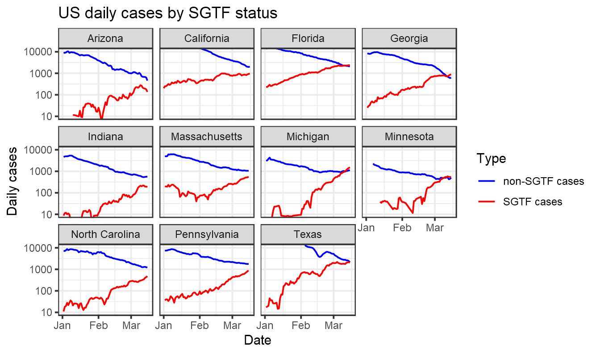

Somebody on Twitter asked me whether B.1.1.7 data from Florida was still compatible with a logistic increase.

It's amazing how simple this sort of thing is to look at with the Tidyverse and nicely formatted SGTF data from [Helix](https://github.com/myhelix/helix-covid19db).

<pre class='chroma'><code class='language-r' data-lang='r'><a href='https://rdrr.io/r/base/library.html'>library</a>(<a href='http://tidyverse.tidyverse.org'>tidyverse</a>)
data = read_csv(<a href='https://rdrr.io/r/base/connections.html'>url</a>("https://raw.githubusercontent.com/myhelix/helix-covid19db/master/counts_by_state.csv"))
state_selection = (data %&gt;% group_by(state) %&gt;% summarise(total=<a href='https://rdrr.io/r/base/sum.html'>sum</a>(positive)) %&gt;% <a href='https://rdrr.io/r/stats/filter.html'>filter</a>(total&gt;5000))$state
data = data  %&gt;% mutate(percent_sgtf=all_SGTF/positive) %&gt;% <a href='https://rdrr.io/r/stats/filter.html'>filter</a>(state %in% state_selection)
ggplot(data,aes(x=collection_date, y=percent_sgtf))+geom_point()+ stat_smooth(method = "glm", method.args = <a href='https://rdrr.io/r/base/list.html'>list</a>(family = "binomial"), se = FALSE,  fullrange=TRUE) +<a href='https://rdrr.io/r/graphics/plot.window.html'>xlim</a>(lubridate::<a href='http://lubridate.tidyverse.org/reference/ymd.html'>ymd</a>("2020-12-01"),lubridate::<a href='http://lubridate.tidyverse.org/reference/ymd.html'>ymd</a>("2021-04-30"))+labs(title="US SGTF",x="Date",y="Percent SGTF")+facet_wrap(~state)+theme_bw()+scale_y_continuous(label=scales::<a href='https://scales.r-lib.org/reference/label_percent.html'>percent</a>)

</code></pre>

There are lots of ways one could improve this, bringing in genome data and modelling uncertainty, but it provides a quick look at what's happening.

**Addendum**

Despite the title, I decided to extend this a bit. Let's first do as above but take rolling averages of SGTF across 7-day intervals:

<pre class='chroma'><code class='language-r' data-lang='r'><a href='https://rdrr.io/r/base/library.html'>library</a>(<a href='http://tidyverse.tidyverse.org'>tidyverse</a>)
<a href='https://rdrr.io/r/base/library.html'>library</a>(<a href='http://zoo.R-Forge.R-project.org/'>zoo</a>)
data = read_csv(<a href='https://rdrr.io/r/base/connections.html'>url</a>("https://raw.githubusercontent.com/myhelix/helix-covid19db/master/counts_by_state.csv"))
state_selection = (data %&gt;% group_by(state) %&gt;% summarise(total=<a href='https://rdrr.io/r/base/sum.html'>sum</a>(positive)) %&gt;% <a href='https://rdrr.io/r/stats/filter.html'>filter</a>(total&gt;5000))$state
data = data  %&gt;% <a href='https://rdrr.io/r/stats/filter.html'>filter</a>(state %in% state_selection) %&gt;% arrange(collection_date) %&gt;% group_by(state) %&gt;% mutate(all_SGTF = <a href='https://rdrr.io/pkg/zoo/man/rollmean.html'>rollsum</a>(all_SGTF,7,na.pad=T),  positive=<a href='https://rdrr.io/pkg/zoo/man/rollmean.html'>rollsum</a>(positive,7,na.pad=T), percent_sgtf=all_SGTF/positive)

#ggplot(data,aes(x=collection_date, y=percent_sgtf))+geom_point()+ stat_smooth(method = "glm", method.args = list(family = "binomial"), se = FALSE,  fullrange=TRUE) +xlim(lubridate::ymd("2020-12-01"),lubridate::ymd("2021-04-30"))+labs(x="Date",y="Percent SGTF")+facet_wrap(~state)+theme_bw()+scale_y_continuous(label=scales::percent)
</code></pre>

And now bring in case data from the New York Times and split these cases by likely SGTF status.

<pre class='chroma'><code class='language-r' data-lang='r'>case_data = read_csv(<a href='https://rdrr.io/r/base/connections.html'>url</a>("https://raw.githubusercontent.com/nytimes/covid-19-data/master/us-states.csv")) %&gt;% rename(State=state)

case_data= case_data %&gt;% group_by(State) %&gt;% arrange(date) %&gt;% mutate(daily_cases=cases-<a href='https://rdrr.io/r/stats/lag.html'>lag</a>(cases)) %&gt;% mutate(smoothed_daily_cases=<a href='https://rdrr.io/pkg/zoo/man/rollmean.html'>rollmean</a>(daily_cases,k=7,na.pad=T))
case_data = read_csv(<a href='https://rdrr.io/r/base/connections.html'>url</a>("https://raw.githubusercontent.com/jasonong/List-of-US-States/master/states.csv"))%&gt;% inner_join(case_data) 
together = data %&gt;% inner_join(case_data,by = <a href='https://rdrr.io/r/base/c.html'>c</a>("collection_date"="date","state"="Abbreviation")) %&gt;% mutate(`SGTF cases` = percent_sgtf * smoothed_daily_cases, `non-SGTF cases` = (1-percent_sgtf) * smoothed_daily_cases) %&gt;% select(State,collection_date,`SGTF cases`,`non-SGTF cases`)  %&gt;% pivot_longer(<a href='https://rdrr.io/r/base/c.html'>c</a>(`SGTF cases`,`non-SGTF cases`))
ggplot(together %&gt;% <a href='https://rdrr.io/r/stats/filter.html'>filter</a>(value&gt;0),aes(x=collection_date, y=value,color=name))+geom_line()+labs(title="US daily cases by SGTF status",x="Date",y="Daily cases",color="Type")+facet_wrap(~State)+theme_bw()+<a href='https://rdrr.io/r/graphics/plot.window.html'>xlim</a>(lubridate::<a href='http://lubridate.tidyverse.org/reference/ymd.html'>ymd</a>("2021-1-01"),NA)+scale_y_log10()+scale_color_manual(values=<a href='https://rdrr.io/r/base/c.html'>c</a>("blue","red"))+coord_cartesian(ylim=<a href='https://rdrr.io/r/base/c.html'>c</a>(10,10000))

</code></pre>

Note that in the graph above we are relying here on SGTF data from one company, Helix, and then assuming it is representative of all cases in a state. This may not be an accurate assumption, as [noted by Marm Kilpatrick](https://twitter.com/DiseaseEcology/status/1377004446639550468). Interpret with caution.

