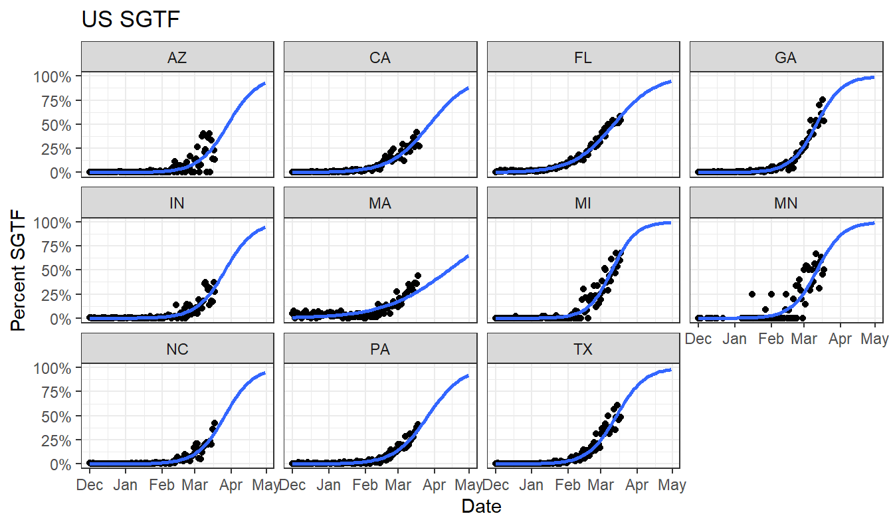

Somebody on Twitter asked me whether B.1.1.7 data from Florida was still compatible with a logistic growth curve.

It's amazing how simple this sort of thing is to look at with the Tidyverse and nicely formatted data SGTF data from [Helix](https://github.com/myhelix/helix-covid19db).

<pre class='chroma'><code class='language-r' data-lang='r'><a href='https://rdrr.io/r/base/library.html'>library</a>(<a href='http://tidyverse.tidyverse.org'>tidyverse</a>)
data = read_csv(<a href='https://rdrr.io/r/base/connections.html'>url</a>("https://raw.githubusercontent.com/myhelix/helix-covid19db/master/counts_by_state.csv"))
state_selection = (data %&gt;% group_by(state) %&gt;% summarise(total=<a href='https://rdrr.io/r/base/sum.html'>sum</a>(positive)) %&gt;% <a href='https://rdrr.io/r/stats/filter.html'>filter</a>(total&gt;5000))$state
data = data  %&gt;% mutate(percent_sgtf=all_SGTF/positive) %&gt;% <a href='https://rdrr.io/r/stats/filter.html'>filter</a>(state %in% state_selection)
ggplot(data,aes(x=collection_date, y=percent_sgtf))+geom_point()+ stat_smooth(method = "glm", method.args = <a href='https://rdrr.io/r/base/list.html'>list</a>(family = "binomial"), se = FALSE,  fullrange=TRUE) +<a href='https://rdrr.io/r/graphics/plot.window.html'>xlim</a>(lubridate::<a href='http://lubridate.tidyverse.org/reference/ymd.html'>ymd</a>("2020-12-01"),lubridate::<a href='http://lubridate.tidyverse.org/reference/ymd.html'>ymd</a>("2021-04-30"))+labs(title="US SGTF",x="Date",y="Percent SGTF")+facet_wrap(~state)+theme_bw()+scale_y_continuous(label=scales::<a href='https://scales.r-lib.org/reference/label_percent.html'>percent</a>)

</code></pre>

There are lots of ways one could improve this, bringing in genome data and modelling uncertainty, but it provides a quick look at what's happening.

