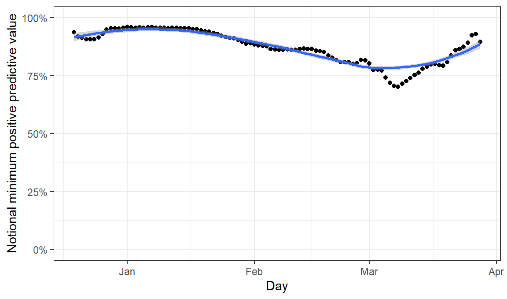

People are very interested in the *positive predictive value* of lateral flow tests. That is, if you receive a positive result from the test, how likely is it that you truly are infected. Personally I think that in terms of measuring whether these tests are helpful, this metric is actually not terribly useful - since it is strongly affected by how much virus is circulating in the population. That means that the metric suggests that lateral flow testing is useless in countries with very low numbers of cases. But actually LFDs have exactly the same effect on R whatever the level of virus in the population, and the same number of absolute false positives.

Nevertheless, it is understandable that people want a test to ideally give them the right answer about their own status. This is helped in part by the fact that the government now says that all LFD positives should be followed up by confirmatory PCR testing, which both helps an individual by confirming their status, and also has the potential to provide us all with information about the reliability of these tests. Information has not been released systematically on what proportion of PCR retests confirm LFD results, but today the coronavirus dashboard has changed to exclude these results. Therefore by comparing today's results with yesterdays we can get a sense of this metric and calculate the minimum possible PPV, assuming that the PCR retest has 100% sensitivity. These sorts of figures have been described by [Oliver Johnson](https://twitter.com/BristOliver/status/1380544543695716353) and [Alex Selby](https://twitter.com/alexselby1770/status/1380614571791151106).

Here is my quick look in R

<pre class='chroma'><code class='language-r' data-lang='r'>

before = read_csv("https://api.coronavirus.data.gov.uk/v2/data?areaType=nation&amp;areaCode=E92000001&amp;metric=newCasesLFDOnlyBySpecimenDate&amp;metric=changeInNewCasesBySpecimenDate&amp;format=csv&amp;release=2021-04-08&amp;metric=newCasesLFDConfirmedPCRBySpecimenDate")

#&gt; Parsed with column specification:
#&gt; cols(
#&gt;   date = col_date(format = ""),
#&gt;   areaType = col_character(),
#&gt;   areaCode = col_character(),
#&gt;   areaName = col_character(),
#&gt;   newCasesLFDOnlyBySpecimenDate = col_double(),
#&gt;   changeInNewCasesBySpecimenDate = col_double(),
#&gt;   newCasesLFDConfirmedPCRBySpecimenDate = col_double()
#&gt; )

after = read_csv("https://api.coronavirus.data.gov.uk/v2/data?areaType=nation&amp;areaCode=E92000001&amp;metric=newCasesLFDOnlyBySpecimenDate&amp;metric=changeInNewCasesBySpecimenDate&amp;format=csv&amp;release=2021-04-09&amp;metric=newCasesLFDConfirmedPCRBySpecimenDate")

#&gt; Parsed with column specification:
#&gt; cols(
#&gt;   date = col_date(format = ""),
#&gt;   areaType = col_character(),
#&gt;   areaCode = col_character(),
#&gt;   areaName = col_character(),
#&gt;   newCasesLFDOnlyBySpecimenDate = col_double(),
#&gt;   changeInNewCasesBySpecimenDate = col_double(),
#&gt;   newCasesLFDConfirmedPCRBySpecimenDate = col_double()
#&gt; )
</code></pre>

<pre class='chroma'><code class='language-r' data-lang='r'><a href='https://rdrr.io/r/base/library.html'>library</a>(<a href='http://zoo.R-Forge.R-project.org/'>zoo</a>)

#&gt; 
#&gt; Attaching package: 'zoo'

#&gt; The following objects are masked from 'package:base':
#&gt; 
#&gt;     as.Date, as.Date.numeric

both = inner_join(before,after,by="date", suffix=<a href='https://rdrr.io/r/base/c.html'>c</a>("_before","_after")) %&gt;% <a href='https://rdrr.io/r/stats/filter.html'>filter</a>(date&gt;"2020-12-15")%&gt;% <a href='https://rdrr.io/r/stats/filter.html'>filter</a>(date&lt;"2021-04-01")

both= both %&gt;% mutate(notional_false_positives = newCasesLFDOnlyBySpecimenDate_before - newCasesLFDOnlyBySpecimenDate_after -  (newCasesLFDConfirmedPCRBySpecimenDate_before - newCasesLFDConfirmedPCRBySpecimenDate_after) ) %&gt;% arrange(date) %&gt;% mutate(notional_false_positives=<a href='https://rdrr.io/pkg/zoo/man/rollmean.html'>rollsum</a>(notional_false_positives,7,na.pad=T),newCasesLFDConfirmedPCRBySpecimenDate_after=<a href='https://rdrr.io/pkg/zoo/man/rollmean.html'>rollsum</a>(newCasesLFDConfirmedPCRBySpecimenDate_after,7,na.pad=T)) %&gt;% mutate( notional_proportion_of_positives_false = notional_false_positives / (notional_false_positives+ newCasesLFDConfirmedPCRBySpecimenDate_after ) )%&gt;% <a href='https://rdrr.io/r/stats/filter.html'>filter</a>(notional_false_positives&gt;0)

ggplot(both,aes(x=date,y=1-notional_proportion_of_positives_false))+geom_point()+geom_smooth()+coord_cartesian(ylim=<a href='https://rdrr.io/r/base/c.html'>c</a>(0,1))+labs(x="Day",y="Notional minimum positive predictive value")+scale_y_continuous(label=scales::<a href='https://scales.r-lib.org/reference/label_percent.html'>percent</a>)+theme_bw() 

#&gt; `geom_smooth()` using method = 'loess' and formula 'y ~ x'

</code></pre>

