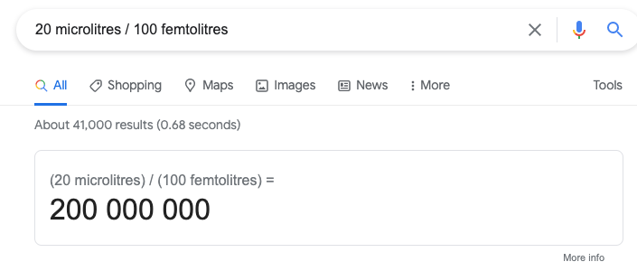
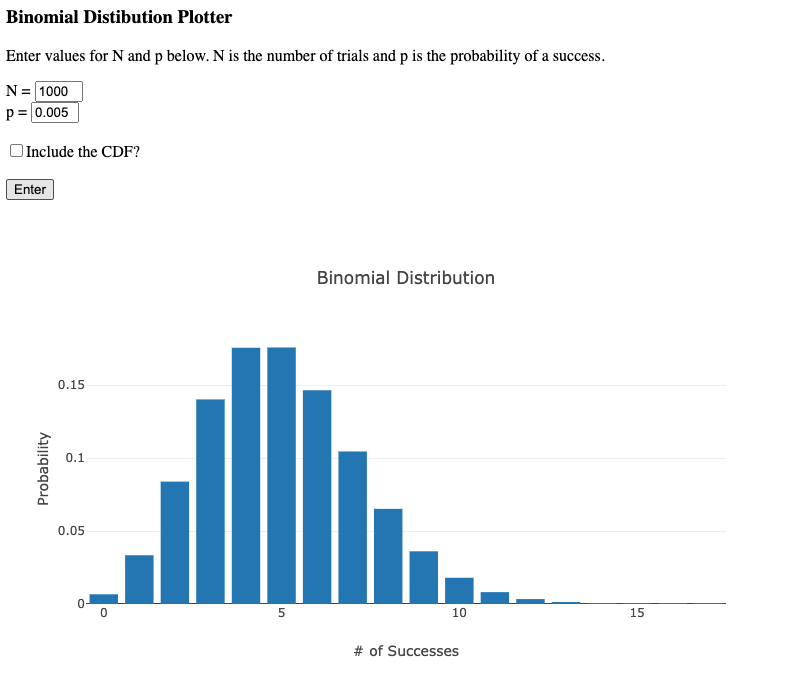

In my time I've done various bits of analysis for barcode-sequencing (barseq) experiments (in _Plasmodium_), and sometimes have chats with people who are starting for the first time. Basically these chats tend to often hit the same two beats about experimental design so here's a quick blog about them.

## Tip 1: work out how many barcodes you expect to go into your process

Probably the biggest contribution I made to the design of barseq experiments I was involved with was to figure out that we simply weren't loading enough barcodes into our PCRs. To figure out whether this could be an issue for you, you just need to work through some simple maths. 

Say you are taking a timecourse of cultured parasites, and at each timepoint you take 1 ml of culture for extraction. If you're working at 2\% haematocrit, then that's 20 μl of packed blood. A red blood cell is about 100 femtolitres, so in this sample you have about 200 million RBCs.

In some of your samples, perhaps parasitaemia is as low as 0.1%? If so then your 200 million RBCs contain 200,000 parasites. Now you take that blood and you put it through a DNA extraction. Suppose this is 50% efficient. Now you are down to 100,000 parasites. You elute in 200 microlitres, so in each microlitre you have just 500 parasites' worth of barcodes. 

Suppose you use 2 μl of template in your barcode amplification PCR, that is 1000 parasites that make it to the PCR. Now suppose you have 20 different barcodes represented in this sample. In an idealised situation where those barcodes are equally abundant you would have 50 barcodes for each of them. In practice however, there is probably quite a range of abundances, perhaps with some barcodes ten times as common as others. So there could easily be barcodes for which we expect only 5 copies to be present in the template.

Of course although we "expect" 5, the process of sampling is essentially a binomial distribution and so we could easily by chance end up with 4, or 6, or 3, or 2. (This is the same sort of uncertainty that one gets in opinion polls with small sample sizes). If in one timepoint by chance one has 2 barcodes, and in the next by chance one has 6, that appears to be a three-fold change which might actually not be meaningful at all.

If one is able to boost the number of barcodes that get into the sample, for instance by extracting into say 10 μl and still loading 2 μl (a twenty-fold boost), one can get a much better signal-to-noise ratio.

## Tip 2: always perform technical duplicate PCRs

We've seen above that random sampling can potentially create uncertainty in your measurements. One issue is that with a single PCR from each sample, you won't actually be aware of these uncertainties! You'll just have some numbers for barcodes present in each sample.

 This is easy to fix by performing technical duplicate PCRs for each sample (N.B. you can probably do even better with UMI approaches, but I haven't yet). You may worry that duplicates aren't enough to quantify uncertainty and that you need triplicates or more, but because you have so many pairwise comparisons in each sample (one for each barcode), you can improve the estimate of uncertainty for a particular barcode by taking a rolling average with other barcodes of similar abundance. And fundamentally with a scatter-plot you can get a good sense of whether a particular sample has failed. The duplicates hugely add to your ability to interpret your data.

This approach lets you quantify the sampling-induced uncertainty for each measurement, and you can then [propagate that uncertainty](https://en.wikipedia.org/wiki/Propagation_of_uncertainty) through to all downstream steps where you calculate downstream values of interest based on these measurements.

