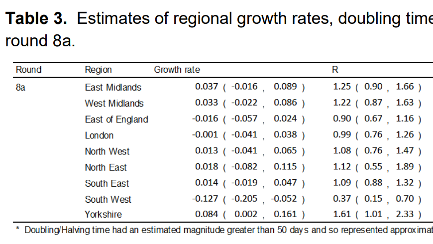

The [latest round of the REACT study](https://spiral.imperial.ac.uk/handle/10044/1/85583) has come out, and been quite controversial. Let's examine some of the raw data behind it.

```{r message=FALSE}
library(tidyverse)
```

Let's download the REACT data and process it into a nice format:
```{r message=FALSE}
positive <- read_csv(url("https://raw.githubusercontent.com/mrc-ide/reactidd/master/inst/extdata/positive.csv"))
total <- read_csv(url("https://raw.githubusercontent.com/mrc-ide/reactidd/master/inst/extdata/total.csv"))
```
```{r}
positive$type = "positive"
total$type = "total"
all = bind_rows(positive, total)
colnames(all)[1] = "Date"

all = all %>% pivot_longer(c(-Date,-type),names_to="Region") %>% pivot_wider(names_from=type)
all
```

Now we can calculate binomial confidence intervals by location for each date and plot them.


```{r}
all = all %>% filter(!is.na(positive)) %>% filter(!is.na(total))
library(binom)

cis = binom.confint(all$positive,all$total, method="exact")


all$lower=cis$lower
all$mean = cis$mean
all$upper=cis$upper

ggplot(all %>% filter(Date>"2020-12-15"),aes(x=Date,ymin=lower,ymax=upper,y=mean))+geom_pointrange(color="black") +facet_wrap(~Region,scales="free_y")+scale_y_log10(labels = scales::percent)+theme_bw() + labs(y="Probability of testing positive")


ggsave("plot.png",width=9,height=5, type="cairo")
```

This looks to accord well with the table of R values that REACT provide in Table 3:


This isn't especially surprising, but I think the visualisation helps to make sense of how these values came to be calculated (even though they are probably based on a more complex analysis weighting for various demographic factors).

That's it for now.