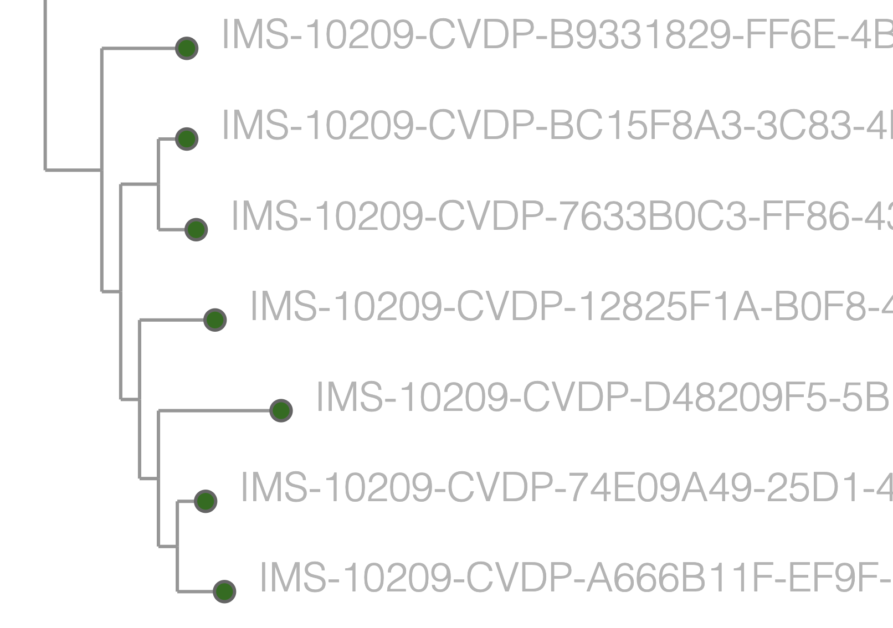

[Taxonium](https://taxonium.org), my tool for exploring large phylogenetic trees, uses  a few tricks to be fast even when exploring trees of 15 million sequences. One is sparsification: there is no need to draw every single node when sometimes thousands are overlapping and occluding those below: where nodes overlap we only draw some of them. But even so, there are tens of thousands of nodes being shown, which means we need a framework for showing them that is faster than classic web approaches. We use [DeckGL](https://deck.gl) which makes use of the GPU to display large numbers of visual elements quickly.

DeckGL is inherently raster-based, it works in pixels. You can take screenshots of it in this pixelly form -- but these aren't great for publications, where we much prefer infinitely zoomable vector graphics. DeckGL doesn't have a way to export in a vector format, due to its underlying architecture, this but I've been thinking for a while that it wouldn't be too hard to hack something together, and have finally got round to trying it.

And it works pretty nicely:


Below is an outline of the approach - this isn't a full tutorial  or anything but might provide some inspiration if you're facing a similar issue.

Normally you build a `layers` object for DeckGL layers which might look something like

```javascript
const layers = [
    new ScatterplotLayer({
      data: [
        {position: [-122.45, 37.8], color: [255, 0, 0], radius: 100}
      ],
      getFillColor: d => d.color,
      getRadius: d => d.radius
    })
  ]
```

To be able to output SVG we want to first build an intermediate version which doesn't use the DeckGL layers (there may be an alternative approach where you use them all along, but anyway..), so we use:

```javascript
const intermediateLayers =  [
    {
      layerType: 'ScatterplotLayer',
      data: [
        {position: [-122.45, 37.8], color: [255, 0, 0], radius: 100}
      ],
      getFillColor: d => d.color,
      getRadius: d => d.radius
    }
  ]
```

Of course we can easily generate our DeckGL layers from this intermediate version:

```javascript
const processedLayers = layers.map((layer) => {
    switch (layer.layerType) {
      case "ScatterplotLayer":
        return new ScatterplotLayer(layer);
      case "LineLayer":
        return new LineLayer(layer);
      case "PolygonLayer":
        return new PolygonLayer(layer);
      case "TextLayer":
        return new TextLayer(layer);
      case "SolidPolygonLayer":
        return new SolidPolygonLayer(layer);
      default:
        console.log("could not map layer spec for ", layer);
    }
});
```

(You may need to add more cases to this switch statement depending on what layers you are using.)

But we can also generate SVG from this same intermediate object. [Here](https://github.com/theosanderson/taxonium/blob/e1758284ecf9bca09593194e74fe3ff52ba372c1/taxonium_component/src/utils/deckglToSvg.js) is the code I use to do that. It won't work for you out of the box, it uses some viewState parameters called `min_x`, `max_x`, `min_y`, `max_y` which I set in other code. But hopefully it may be a source of inspiration in terms of how to go about things.

Here's the function that does the real work:
    
```javascript

const getSVG = (layers, viewState, svgWidth, svgHeight) => {
const applyBounds = (point) => {
    const minY = viewState.min_y;
    const maxY = viewState.max_y;
    const minX = viewState.min_x;
    const maxX = viewState.max_x;
    const initial = point;
    const x = normalise(initial[0], minX, maxX);
    const y = normalise(initial[1], minY, maxY);
    return [x * svgWidth, y * svgHeight];
};
if (!viewState.min_x) {
    window.alert("Please zoom in and out a little before SVG export");
    return false;
}
let svgContent = `<svg xmlns='http://www.w3.org/2000/svg' width="${svgWidth}" height="${svgHeight}">`;

for (const layer of layers) {
    // unless layer id starts with "main"
    if (!layer.id.startsWith("main")) {
    continue;
    }

    switch (layer.layerType) {
    case "ScatterplotLayer":
        for (const point of layer.data) {
        const [x, y] = applyBounds(layer.getPosition(point));
        // if either is null, skip this point
        if (x === null || y === null) {
            continue;
        }
        const accessor = layer.getFillColor
            ? layer.getFillColor
            : layer.getColor;
        let color;
        if (!accessor) {
            // make color transparent
            color = "none";
        } else {
            const initColor = accessOrConstant(accessor, point);
            // if rgba
            if (initColor.length === 4) {
            color = `rgba(${initColor.join(",")})`;
            if (initColor[3] === 0) {
                color = "none";
            }
            }
            // if rgb
            else if (initColor.length === 3) {
            color = `rgb(${initColor.join(",")})`;
            } else {
            console.warn("Unsupported color format");
            }
        }
        // check if stroked
        let strokeColor, strokeWidth;
        if (layer.stroked) {
            strokeColor = accessOrConstant(layer.getLineColor, point).join(
            ","
            );
            strokeWidth = accessOrConstant(layer.getLineWidth, point);
        }

        // if getRadius is a fn call it otherwise assume it's a value
        const radius = accessOrConstant(layer.getRadius, point);
        svgContent += `<circle cx="${x}" cy="${y}" r="${radius}" fill="${color}"
        ${
            layer.stroked
            ? `stroke="rgb(${strokeColor})" stroke-width="${strokeWidth}"`
            : ""
        } />`;
        }
        break;

    case "LineLayer":
        for (const line of layer.data) {
        const [x1, y1] = applyBounds(layer.getSourcePosition(line));
        const [x2, y2] = applyBounds(layer.getTargetPosition(line));
        // if either is null, skip this point
        if (x1 === null || y1 === null || x2 === null || y2 === null) {
            continue;
        }
        const colorAccessor = layer.getLineColor
            ? layer.getLineColor
            : layer.getColor;
        // if colorAccessor is a function, call it with the line as an argument, otherwise assume it's an array
        const color = accessOrConstant(colorAccessor, line).join(",");
        const width = accessOrConstant(layer.getWidth, line);
        svgContent += `<line x1="${x1}" y1="${y1}" x2="${x2}" y2="${y2}" stroke="rgb(${color})" stroke-width="${width}" />`;
        }
        break;

    case "TextLayer":
        for (const text of layer.data) {
        //const [x, y] = applyModelMatrix(layer.modelMatrix, layer.getPosition(text));
        const original = layer.getPosition(text);
        const adjusted = applyBounds(original);

        const [x, y] = adjusted;
        const size = accessOrConstant(layer.getSize, text);
        const alignment = accessOrConstant(
            layer.getAlignmentBaseline,
            text
        );
        const anchor = accessOrConstant(layer.getTextAnchor, text);
        const pixelOffset = accessOrConstant(layer.getPixelOffset, text);

        const color = accessOrConstant(layer.getColor, text).join(",");
        const newContent = `<text x="${x}" y="${y}" font-family="${
            layer.fontFamily
        }" font-weight="${layer.fontWeight}" fill="rgb(${color})"
        font-size="${size}" text-anchor="${anchor}" alignment-baseline="${alignment}" dx="${
            pixelOffset[0]
        }" dy="${pixelOffset[1]}"
        >${layer.getText(text)}</text>`;
        svgContent += newContent;
        }
        break;

    // You can extend this with other layer types such as PolygonLayer, SolidPolygonLayer, etc.

    default:
        console.warn(`Unsupported layer type: ${layer.layerType}`);
        break;
    }
}

svgContent += "</svg>";
return svgContent;
};
```

There's also a useful function in there that will trigger a download of the SVG.

You can see it all in accession by clicking the 📷 button in the bottom right on [Cov2Tree](//cov2tree.org).

Anyway, if you're stuck on this problem hopefully this provides inspiration that a solution is possible. Best of luck!